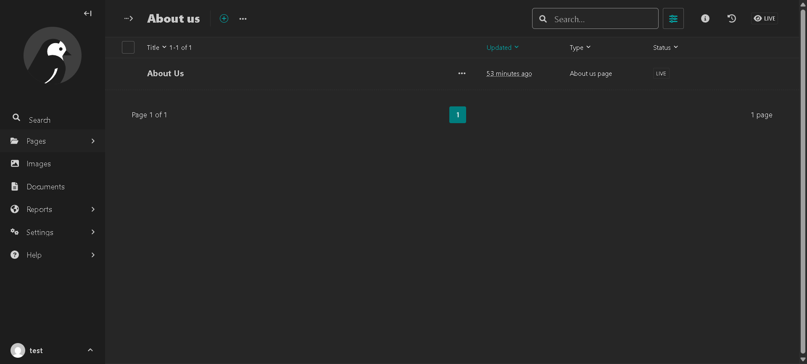
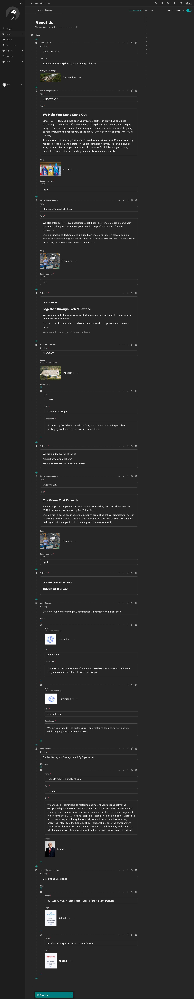
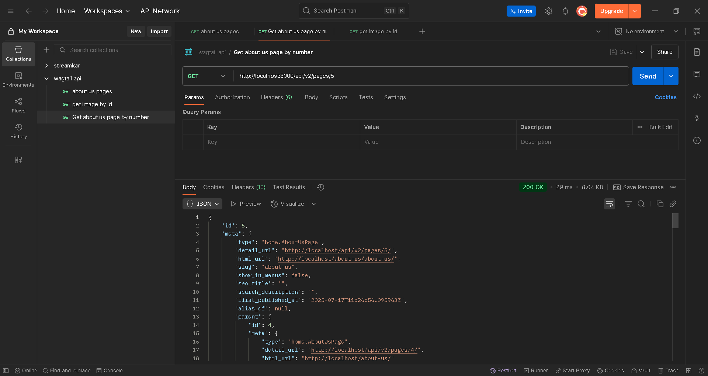
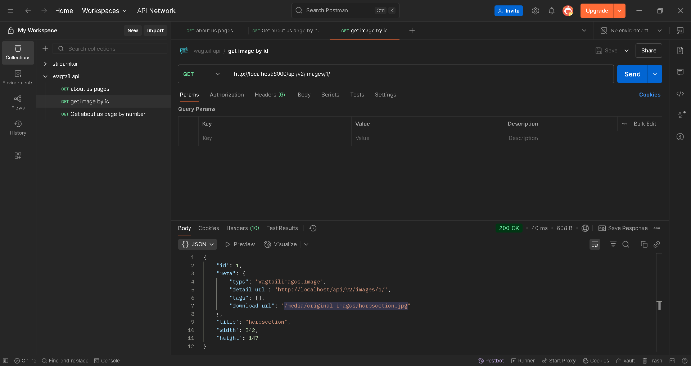

Hitech About Us - Headless CMS using Wagtail

This project is a headless CMS built with Wagtail. It models the content for the "About Us" page shown in the UI screenshot. All content is managed through the Wagtail admin and served through APIs. There is no frontend HTML or templates.

Technologies used:

Python

Django

Wagtail CMS

Wagtail API (v2)

SQLite (default)

Content structure:

I created a page model called AboutUsPage. It has a body field, which is a StreamField. Inside that, I used the following blocks:

- hero_section: heading, subheading, and background image
- text_image_section: title, rich text, image, and image position
- value_section: repeatable items with icon image, title, and description
- milestone_section: heading, image, and a list of year, title, description
- team_section: heading and a list of members (name, role, photo, bio)
- logo_section: heading and a list of logos (name, image)
- rich_text: plain rich text block for descriptions

API Endpoints:

- /api/v2/pages/?slug=about-us to get the full content of the page
- /api/v2/pages/<id>/ to get content by page ID
- /api/v2/images/<id>/ to get full image data using image ID

Note: Image fields return just the ID. To get the full image URL and title, use the image API endpoint with the ID.

Postman:

I have included a Postman collection in the repo to test the APIs.

Admin access:

To access the Wagtail admin, run the server and go to http://localhost:8000/admin.

Create a superuser to log in.

How to run the project:

1. Clone the repo.
2. Create a virtual environment.
3. Activate the virtual environment.
4. Install requirements using pip install -r requirements.txt.
5. Run migrations.
6. Create a superuser.
7. Run the server.

After that, go to Wagtail admin and view the page data. You can use the API URL to get all content.

Deliverables included:

- Wagtail project
- Page model and blocks
- Sample content added
- API working for all sections
- Postman collection to test
- Image support using image ID and image API

Images:

#### Admin Panel  - About Us Page 

#### Admin Panel - About Us Page StreamField Blocks

#### API Response - StreamField Blocks

#### API Response - Images
